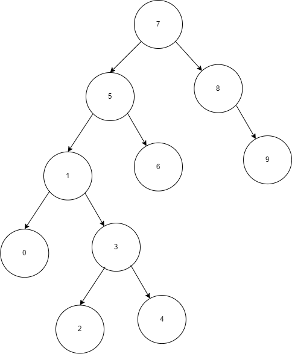

# Binary Search Tree

## a) For [7, 5, 1, 8, 3, 6, 0, 9, 4, 2] write instertion steps.

1. 7 is added as root.
2. 5 is added as left node of 7.
3. 1 is added as left node of 5.
4. 8 is added as right node of 7.
5. 3 is added as right node of 1.
6. 6 is added as right node of 5.
7. 0 is added left node of 1.
8. 9 is added right node of 8.
9. 4 is added as right node of 3.
10. 2 is added as left node of 3.

